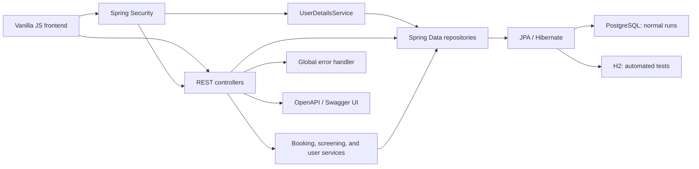
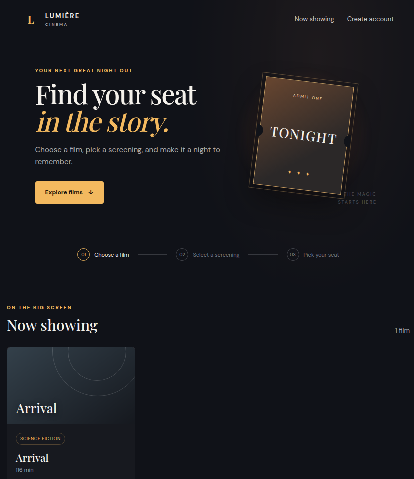
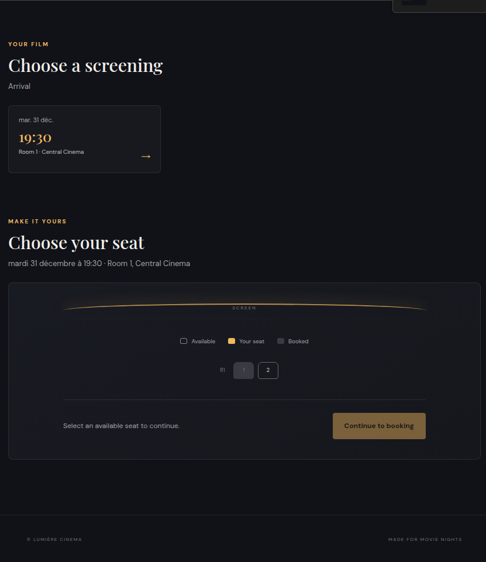
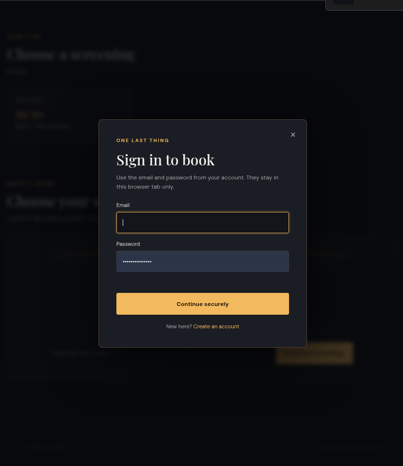
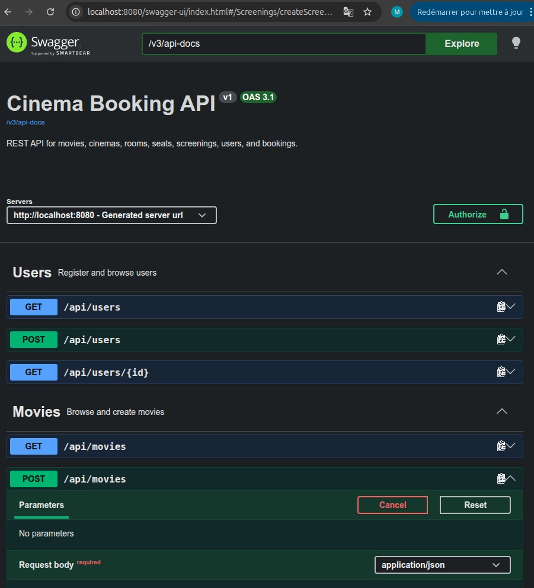

# Cinema Booking API

A beginner-friendly REST backend for managing cinema movies, cinemas, rooms, seats, screenings, users, and seat bookings. The application is built with Java 21 and Spring Boot 4.1.1.

## Features

- Create and browse movies, cinemas, rooms, seats, and future screenings.
- Register users with email validation and unique email addresses.
- Browse movies and screenings and choose a room seat in the bundled browser UI.
- Reserve a seat for a screening as the authenticated user.
- Reject invalid, past, wrong-room, and duplicate seat bookings.
- Inspect API routes and request models with Swagger UI.

## Architecture

The code is grouped by feature under `com.cinema.booking`:

- `movie`, `cinema`, `screening`, `booking`, and `user` contain each feature's API/controller, service (where business rules are needed), repository, entity, and request/response models.
- `security` configures HTTP Basic and looks users up by email.
- `common` contains the shared API error response and global exception handler.
- `config` contains OpenAPI metadata.

Controllers receive HTTP requests, services enforce multi-step business rules, repositories access the database, and JPA entities represent database records. Request and response records define the JSON used by selected endpoints.



## Technologies

- Java 21, Spring Boot 4.1.1, Spring MVC
- Spring Data JPA and Hibernate
- PostgreSQL for normal application runs; H2 for automated tests
- Spring Security HTTP Basic and BCrypt password hashing
- Jakarta Bean Validation
- OpenAPI and Swagger UI through springdoc
- Maven, JUnit, MockMvc, Docker, Docker Compose

## Entity relationships

- One `Cinema` has many `Room`s; each room belongs to one cinema.
- One `Room` has many `Seat`s; each seat belongs to one room.
- A `Screening` references one `Movie` and one `Room`; either can be referenced by many screenings.
- A `Booking` references one `Screening`, one `Seat`, and one `User`; each of those can be referenced by many bookings.
- The database has a unique constraint on `(screening_id, seat_id)`, so the same seat cannot be booked twice for the same screening.

## Authentication flow

User registration is public at `POST /api/users`. The submitted password is hashed with BCrypt before it is stored, and user responses never include the password or hash. There is no separate login endpoint: clients use HTTP Basic by sending their registered email and password with protected requests. Spring Security authenticates those credentials against the database. `POST /api/bookings` gets its owner from that authenticated identity; clients do not send a `userId`.

### Current security scope and limitations

Only `POST /api/bookings` currently requires authentication. User listing, booking reads, and all cinema catalog write endpoints are public; this is a learning-project policy, not suitable for a public production service. HTTP Basic sends credentials with every protected request, so production traffic must use HTTPS. The browser UI keeps credentials in `sessionStorage` for the tab session, where they are readable by scripts running on the same origin. Sign out clears them, but this simple approach is not equivalent to a hardened production login/session design.

## Booking and double-booking protection

When creating a booking, the service checks that the screening and seat exist, that the seat belongs to the screening's room, and that the screening is in the future. It checks whether the seat is already booked for that screening. The database unique constraint is the final safeguard if two requests race and both pass the service check.

## Configuration

The regular application profile requires these environment variables; credentials are not stored in the repository:

| Variable | Purpose | Example |
| --- | --- | --- |
| `DB_URL` | JDBC connection URL | `jdbc:postgresql://localhost:5432/cinema` |
| `DB_USERNAME` | PostgreSQL username | `cinema_app` |
| `DB_PASSWORD` | PostgreSQL password | Set a local value privately |

The test profile is configured in `src/test/resources/application.properties` and uses an in-memory H2 database. Tests do not require PostgreSQL to be running.

## Run locally

1. Start PostgreSQL locally, or start only the PostgreSQL container with `docker compose up -d postgres` after following the Docker setup below.
2. Set the database environment variables in the terminal where the app will run. For example:

   ```bash
   export DB_URL=jdbc:postgresql://localhost:5432/cinema
   export DB_USERNAME=cinema_app
   export DB_PASSWORD='your-local-password'
   ```

   The database and account must already exist when using a separately installed PostgreSQL server.
3. Run the app:

   ```bash
   ./mvnw spring-boot:run
   ```

The API and frontend listen on `http://localhost:8080`. Hibernate currently uses `ddl-auto=update` to create/update tables during development. Before production, replace automatic schema updates with versioned database migrations (for example, Flyway or Liquibase).

## Docker Compose

Copy `.env.example` to `.env`, then replace the sample password with a private local value. `.env` is ignored by Git. Compose passes these values to PostgreSQL and supplies the corresponding `DB_*` variables to the application container.

```bash
cp .env.example .env
# Edit .env and set a private POSTGRES_PASSWORD.
docker compose up --build
```

Compose builds the application image, starts PostgreSQL, waits for its health check, and then starts the API. PostgreSQL data persists in the `postgres_data` named volume. Open `http://localhost:8080/swagger-ui.html` to inspect the API.

To stop the containers while keeping database data:

```bash
docker compose down
```

To also delete the database volume and its data:

```bash
docker compose down -v
```

## Swagger / OpenAPI

With the application running, open Swagger UI at `http://localhost:8080/swagger-ui.html`. The generated OpenAPI JSON is at `http://localhost:8080/v3/api-docs`. Swagger reads controller mappings and request/response types; validation annotations describe required fields, and the booking creation operation declares HTTP Basic authentication. Use Swagger's **Authorize** control with a registered email and password to try it.

## Frontend

Spring Boot serves the vanilla HTML, CSS, and JavaScript frontend from `src/main/resources/static`. Open `http://localhost:8080/` for movie browsing and seat booking, or `http://localhost:8080/register.html` to register. The browser calls the same-origin REST API with `fetch()`. The sequence is Movie → Screening → Room → Seat → Booking; room names are looked up through the existing cinema/room endpoints, while booked seats are shown as unavailable using the screening bookings endpoint. The server remains responsible for the final booking checks.
## Screenshots

### Home / Movies


### Seat selection


### Booking confirmation


### Swagger UI

## Main API endpoints

| Method | Path | Purpose | Authentication |
| --- | --- | --- | --- |
| `POST` | `/api/users` | Register a user | Public |
| `GET` | `/api/users`, `/api/users/{id}` | List or get users | Public |
| `POST` | `/api/movies` | Create a movie | Public |
| `GET` | `/api/movies`, `/api/movies/{id}` | List or get movies | Public |
| `POST` | `/api/cinemas` | Create a cinema | Public |
| `GET` | `/api/cinemas`, `/api/cinemas/{id}` | List or get cinemas | Public |
| `POST` | `/api/cinemas/{cinemaId}/rooms` | Create a room | Public |
| `GET` | `/api/cinemas/{cinemaId}/rooms` | List a cinema's rooms | Public |
| `POST` | `/api/rooms/{roomId}/seats` | Create a seat | Public |
| `GET` | `/api/rooms/{roomId}/seats`, `/api/seats/{seatId}` | List or get seats | Public |
| `POST` | `/api/screenings` | Create a screening | Public |
| `GET` | `/api/screenings`, `/api/screenings/{id}` | List or get screenings | Public |
| `GET` | `/api/movies/{movieId}/screenings` | List a movie's screenings | Public |
| `GET` | `/api/rooms/{roomId}/screenings` | List a room's screenings | Public |
| `POST` | `/api/bookings` | Book a seat | HTTP Basic |
| `GET` | `/api/bookings`, `/api/bookings/{id}` | List or get bookings | Public |
| `GET` | `/api/screenings/{screeningId}/bookings` | List a screening's bookings | Public |

Booking creation JSON contains only `screeningId` and `seatId`; the user comes from HTTP Basic credentials.

## Tests

Run all tests with:

```bash
./mvnw test
```

The tests use H2 and MockMvc, so they run without a PostgreSQL server.
